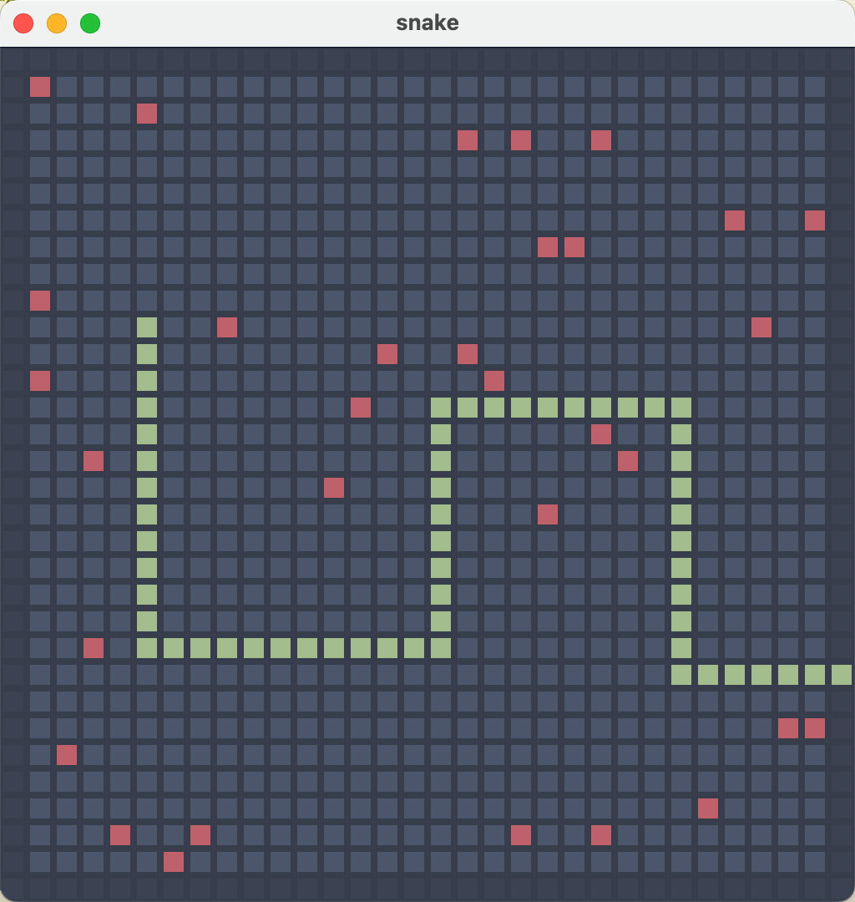

# Snake

* JDK: 17+
* `Q`: Quit
* `R`: Reset
* `P`: Play/Pause
* Move
    * `K`: Up
    * `J`: Down
    * `H`: Left
    * `L`: Right
* Level
    * `1` a food. snail.
    * `2` More food. progressive.
    * `3` More food. quick.

